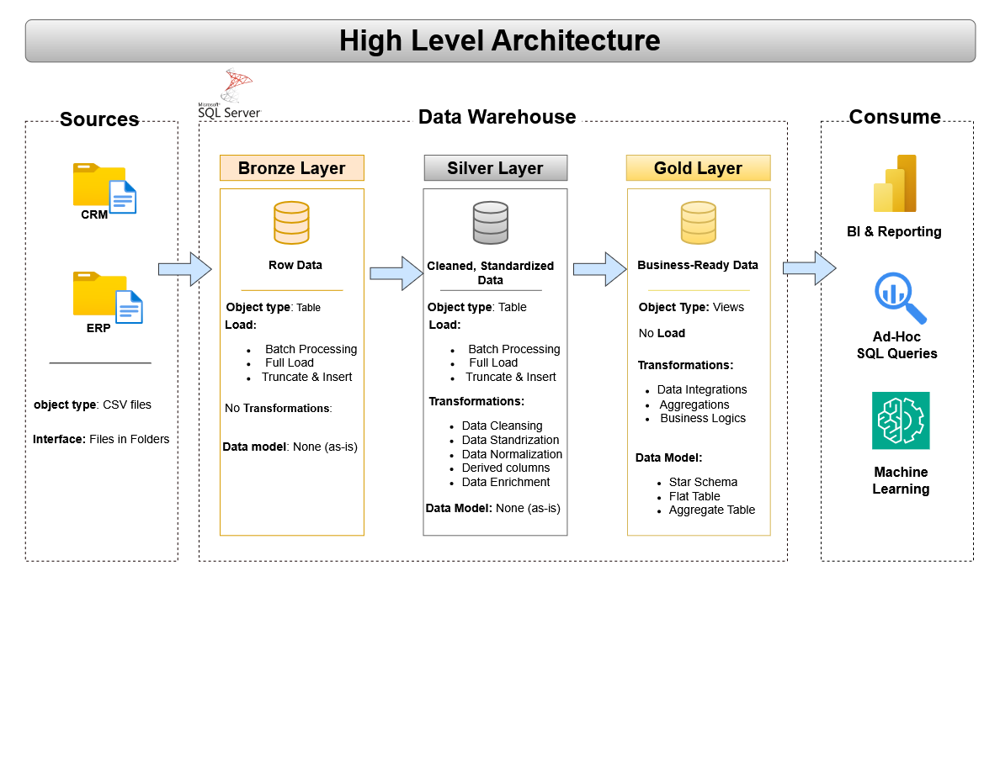

# 🧠 SQL Data Warehouse Project (ETL + Modeling + Architecture)

Welcome to my SQL Data Warehouse Project! 🚀
This repository showcases a full end-to-end Data Warehouse built from scratch — including ETL development, data modeling, architecture design, and clean repository structuring.

The project is designed as a practical portfolio piece to demonstrate real-world data engineering practices using only SQL Server.

---

# 🏗 Medallion Data Architecture

This Data Warehouse follows the Medallion Architecture, organizing data into three structured layers:

---

## 1. Bronze Layer – Raw Data Ingestion

- Ingests and stores raw data as-is from source systems (CRM & ERP) into the SQL Server database using automated load scripts.

## 2. Silver Layer – Transformation & Standardization

- Cleans, standardizes, normalizes and enriches data to ensure consistency and quality.
- Applies business rules and validation logic, with error handling & logging for ETL monitoring 
  

## 3. Gold Layer – Business-Ready Data Model

- Builds fact and dimension tables following a star schema
- Produces business-ready, analytics-ready datasets optimized for reporting  

---

# ⚙️ Project Overview
1. **Data Architecture**: Designing a modern Data Warehouse using the Medallion architecture with **Bronze, Silver** and **Gold** layers.
2. **ETL Pipeline**: Implementing an end-to-end ETL pipeline to extract, transform and load data from source systems into the arehouse
3. **Data Modeling**: Building fact and dimension tables optimized for analytical queries & reporting

---

# 📁 Repository Structure

SQL-Data-Warehouse-Project/ ├── Datasets/ │   ├── source_crm/ │   │   ├── cst_ifo.csv           → Customer information from CRM │   │   ├── prd_ifo.csv           → Product information from CRM │   │   └── sales_details.csv     → Sales transactions from CRM │   └── source_erp/ │       ├── CUST-AZ12             → ERP Customer data │       ├── LOC_A101              → ERP Location data │       └── PX_CAT_G1V2           → ERP Product Category data ├── Docs/ │   ├── Data_architecture.png      → High-level architecture diagram │   ├── Data_catalog.md            → Data dictionary & catalog │   ├── Data_flow.png              → ETL/data flow diagram │   └── Data_model.pbg             → Star schema / data model diagram ├── Scripts/ │   ├── Bronze/ │   │   ├── ddl_bronze/           → Bronze layer table definitions │   │   └── proc_load_bronze/     → Stored procedures to load raw data │   ├── Silver/ │   │   ├── ddl_silver/           → Silver layer table definitions │   │   └── proc_load_silver/     → Stored procedures for data transformation │   └── Gold/ │       └── ddl_gold/             → Gold layer table definitions (fact & dimension tables) ├── Test/ │   ├── Quality_checks_silver/     → Data quality checks for Silver layer │   └── Quality_checks_gold/       → Data quality checks for Gold layer └── README.md
--------------------------

# 🧰 Tools & Technologies

- SQL Server – Database platform and ETL execution  
- T-SQL Stored Procedures – Data transformation logic  
- draw.io – Architecture and data modeling diagrams  
- CSV / Excel – Source data files  
- GitHub – Version control and project documentation  

---

# 🔮 Future Improvements

This project will be re-implemented using:

- Python – For ETL transformations and data manipulation  
- Apache Airflow – To automate and orchestrate ETL pipelines  

The goal is to build a fully orchestrated, automated modern data pipeline with better scheduling, monitoring, and scalability.
